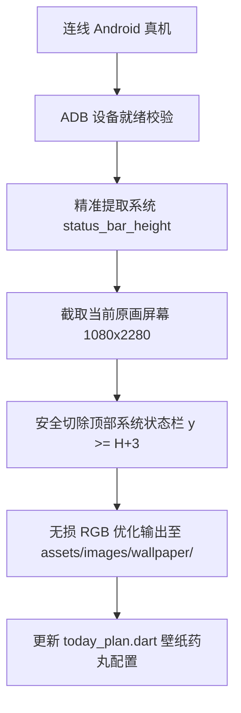

# Android 连线真机屏幕壁纸抓取与状态栏自动切除 (Android Wallpaper Capture)

本 Skill 用于将通过 USB 或无线调试连线的真实 Android 手机屏幕画面，一键无损抓取并自动剥除顶部的系统状态栏信息（时间、电量、通知图标、信号栏等），格式化为 App 的高质量专属壁纸。

---

## 核心设计与处理规范



### 1. 顶部状态栏精准切除原则
- **拒绝主观硬编码**：优先通过 `adb shell dumpsys window windows` 匹配 `mContentInsets=[0,H]` 或 `StatusBar` 实际物理高度（常见为 `72px` 或 `80px`）。
- **抗锯齿安全裕度**：在系统实际状态栏高度基础上增加 `+3px` 保护裕度，确保任何亚像素渲染的字体底边或阴影不残留。
- **全屏 BoxFit 兼容**：Flutter 渲染壁纸统一采用 `BoxFit.cover`，轻微切除几十像素完全无损铺满，保证画面的原生纯净质感。

---

## 工具脚本与一键执行

所有配套脚本位于当前 Skill 的 `scripts/` 目录下：

```bash
# 1. 最简执行（自动检测设备、自动探查状态栏、保存为 assets/images/wallpaper/bamboo.jpg）
python3 .agents/skills/android-wallpaper-capture/scripts/capture_wallpaper.py --name bamboo

# 2. 抓取并自动配置进「今日计划」快捷切换选项
python3 .agents/skills/android-wallpaper-capture/scripts/capture_wallpaper.py --name bamboo --title 竹韵 --update-code

# 3. 指定设备与手动切除参数
python3 .agents/skills/android-wallpaper-capture/scripts/capture_wallpaper.py --name mountain --title 青峰 --serial YXDBB20628208720 --crop-top 75 --update-code
```

### 常用参数说明

| 参数 | 必填 | 默认值 | 说明 |
|---|---|---|---|
| `--name` | 是 | - | 壁纸英文文件名标识（如 `bamboo`、`sunset`） |
| `--title` | 否 | None | App 界面中显示的中文名称（如 `竹韵`、`晨光`） |
| `--serial` | 否 | 自动检测 | ADB 设备序列号（单机连线时自动识别） |
| `--crop-top` | 否 | 自动探测 + 3 | 顶部状态栏裁切像素高度 |
| `--crop-bottom` | 否 | 0 | 底部裁切像素高度（如存在手势横条时可传） |
| `--update-code` | 否 | False | 是否自动写入 `app/lib/page/today_plan.dart` 选项 |

---

## 设备排查指引

若提示 `未检测到已连接并授权的 Android 设备`：
1. **USB 连线与模式**：确认手机已连接 Mac，下拉通知栏将连接模式从「仅充电」改为「传输文件 (MTP)」。
2. **开发者选项**：确认开启「设置 -> 开发者选项 -> USB 调试」。
3. **授权弹窗**：亮屏解锁手机，在「允许 USB 调试吗？」弹窗中勾选并点击确定。
4. **服务自检**：执行 `adb kill-server && adb start-server && adb devices` 刷新。
