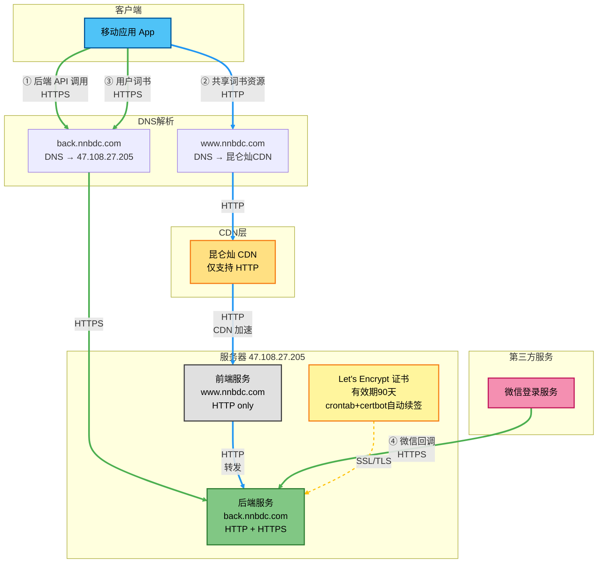
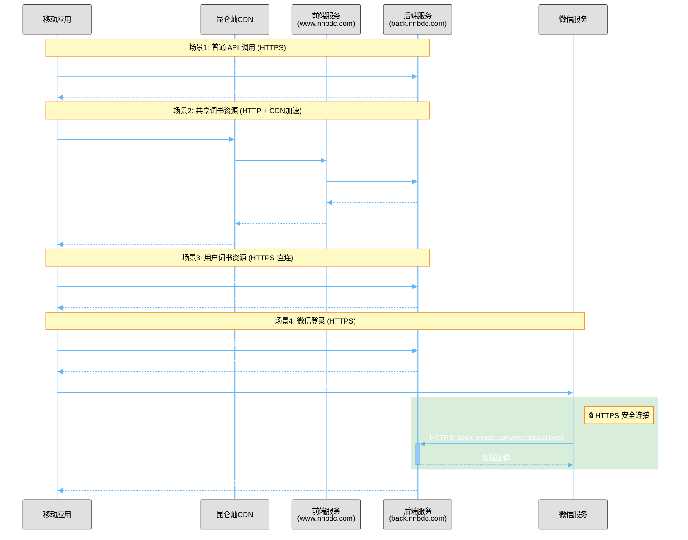

# NNBDC HTTP/HTTPS 架构设计

## 架构概述

本文档说明 NNBDC 应用与服务器之间的 HTTP/HTTPS 通信架构设计。

## 域名配置

| 域名 | 用途 | DNS 指向 | 协议支持 |
|------|------|---------|---------|
| www.nnbdc.com | 前端服务 | 昆仑灿 CDN | HTTP only |
| back.nnbdc.com | 后端服务 | 47.108.27.205 | HTTPS only |

## HTTPS 证书说明

- **back.nnbdc.com**: 使用 Let's Encrypt 证书（有效期90天），实际启用 HTTPS
- **自动续签**: 通过 crontab + certbot 实现自动续签
- **www.nnbdc.com / nnbdc.com**: 虽然脚本申请了证书，但**实际未启用 HTTPS**（因中间经过昆仑灿 CDN，多了一跳，配置复杂且无实际需求）

## 架构图



### 图例说明

- 🔵 **蓝色实线** - HTTP 连接
- 🟢 **绿色实线** - HTTPS 连接（安全加密）
- 🟡 **黄色虚线** - SSL/TLS 证书关联

## 资源访问策略

### 1. 后端 API 访问
- **URL**: `https://back.nnbdc.com/api/*`
- **协议**: **HTTPS（强制）**
- **路由**: App → back.nnbdc.com (直连)
- **用途**: 所有后端业务 API 调用
- **安全**: TLS 1.2/1.3 加密，HSTS 保护

### 2. 共享词书资源
- **URL**: `http://www.nnbdc.com/back/getDictResById.do`
- **协议**: HTTP
- **路由**: App → www.nnbdc.com (CDN) → 前端 nginx (`/back/` 代理) → 后端服务
- **优势**: 利用昆仑灿 CDN 加速资源分发
- **适用**: 公共词书、共享词典等静态资源
- **nginx 配置**: 前端配置中的 `location /back/` 将请求代理到 `127.0.0.1:5200`

### 3. 用户词书资源（生词本）
- **URL**: `https://back.nnbdc.com/getDictResById.do`
- **协议**: **HTTPS（强制）**
- **路由**: App → back.nnbdc.com (直连)
- **用途**: 用户私有数据，不经过 CDN
- **安全**: 加密传输，保护用户隐私

### 4. 微信登录回调
- **URL**: `https://back.nnbdc.com/wechat/callback`
- **协议**: HTTPS（**必须**）
- **原因**: 微信要求回调地址必须使用 HTTPS
- **证书**: Let's Encrypt 自动续签

## 通信流程时序图



## 设计决策说明

### 为什么 www.nnbdc.com 不支持 HTTPS？

由于 www.nnbdc.com 的 DNS 指向昆仑灿 CDN，中间多了一跳，配置和管理复杂度增加：

1. **证书管理复杂**: 需要在 CDN 层配置证书
2. **多层转发**: CDN → 源服务器的链路需要额外配置
3. **成本考虑**: CDN HTTPS 可能产生额外费用
4. **实际需求**: 前端静态资源和公共词书资源对 HTTPS 需求不强

> **注意**: 虽然 `setup-https.sh` 脚本会为主域名申请 Let's Encrypt 证书，但在 nginx 配置中并未启用 HTTPS 监听，该证书实际处于未使用状态。

### 为什么 back.nnbdc.com 强制使用 HTTPS？

1. **微信登录要求**: 微信 OAuth 回调必须使用 HTTPS
2. **数据安全**: 
   - 用户登录凭证、个人信息需要加密传输
   - 学习记录、生词本等私密数据保护
   - 防止中间人攻击和数据劫持
3. **WebSocket 安全**: Socket.IO 实时通信需要加密保护
4. **行业最佳实践**: 
   - 现代 Web 应用标准要求
   - 符合 GDPR、等保等合规要求
   - 提升用户信任度
5. **技术优势**: 
   - HTTP/2 性能提升（必须基于 HTTPS）
   - HSTS 防护，增强安全性
   - 直连服务器，证书配置简单

### 资源分流策略

- **公共资源** → 走 CDN（www.nnbdc.com）：充分利用 CDN 缓存和加速能力
- **私有数据** → 直连后端（back.nnbdc.com）：保证数据安全性和实时性

## 自动化运维

### 证书自动续签

本项目使用 Docker 容器化部署 certbot，通过 cron 定时任务实现证书自动续签。

#### crontab 配置

```bash
# 每月1号凌晨3点执行证书续签
0 3 1 * * /root/renew-cert.sh >> /var/log/certbot-renew.log 2>&1
```

#### 续签脚本 (`/root/renew-cert.sh`)

```bash
#!/bin/bash
# SSL证书自动续期脚本 - 零停机方案
# 适配 Docker 容器化部署

# 设置 PATH 环境变量（crontab 环境中可能不包含 /usr/bin）
PATH=/usr/local/sbin:/usr/local/bin:/usr/sbin:/usr/bin:/sbin:/bin

NGINX_CONTAINER="nginx"
WEBROOT_HOST="/var/www/html"  # 宿主机 webroot 目录（映射到容器的 /usr/share/nginx/html）

echo "开始证书续期（零停机模式）: $(date)"

# 确保验证目录存在（在宿主机上）
mkdir -p $WEBROOT_HOST/.well-known/acme-challenge

# 使用 webroot 模式续期所有证书（nginx 无需停止）
# 注意：webroot 路径使用宿主机路径，因为 volume 挂载的是 /var/www/html
docker run --rm \
    -v /etc/letsencrypt:/etc/letsencrypt \
    -v /var/lib/letsencrypt:/var/lib/letsencrypt \
    -v $WEBROOT_HOST:/webroot \
    certbot/certbot renew \
    --webroot -w /webroot

# 重载nginx配置以应用新证书
docker exec $NGINX_CONTAINER nginx -s reload

echo "证书续期完成（服务未中断）: $(date)"
```

#### 续签说明

- **工具**: certbot Docker 镜像 (certbot/certbot)
- **部署方式**: Docker 容器化（nginx 通过 systemd 管理）
- **续签模式**: **webroot 模式（零停机）** ⚡
- **执行时间**: 每月1号凌晨3点
- **执行方式**: 
  1. 在宿主机上创建验证目录 `/var/www/html/.well-known/acme-challenge/`
  2. 运行 certbot 容器执行续签（**nginx 保持运行**）
  3. certbot 将验证文件写入宿主机 `/var/www/html`（容器内映射为 `/usr/share/nginx/html`）
  4. Let's Encrypt 通过 HTTP 访问验证文件
  5. certbot 更新宿主机 `/etc/letsencrypt` 的证书（容器只读挂载，但宿主机可写）
  6. 重载 nginx 配置（仅重载，无需重启）
- **服务中断时间**: **0 秒**（零停机）✅
- **证书有效期**: 90天（Let's Encrypt 标准）
- **续签时机**: 证书剩余30天时自动续签
- **日志位置**: `/var/log/certbot-renew.log`
- **申请的证书**: 
  - nnbdc.com + www.nnbdc.com（已申请但**未启用**）
  - back.nnbdc.com（**实际使用中**）

**Docker 部署关键配置**：
```bash
# docker.nginx.service 中的关键挂载
-v /var/www/html:/usr/share/nginx/html       # webroot 映射
-v nginxcnf:/etc/nginx                       # nginx 配置（named volume）
-v /etc/letsencrypt:/etc/letsencrypt:ro      # 证书目录（只读）
```

#### 零停机续签原理

**webroot 模式工作流程（Docker 环境）**：

1. 续签脚本在宿主机创建目录 `/var/www/html/.well-known/acme-challenge/`
2. certbot 容器将验证文件写入该目录（通过 volume 挂载）
3. nginx 容器通过 volume 挂载访问该目录（容器内路径 `/usr/share/nginx/html/.well-known/acme-challenge/`）
4. Let's Encrypt 服务器通过 HTTP 访问 `http://back.nnbdc.com/.well-known/acme-challenge/xxx`
5. nginx 根据配置直接返回验证文件（**无需停止服务**）
6. 验证成功后，certbot 更新宿主机 `/etc/letsencrypt` 的证书文件
7. nginx 容器通过只读挂载自动看到新证书
8. nginx reload 加载新证书（**仅重载配置，连接不中断**）

**路径映射关系**：

| 宿主机路径 | 容器内路径 | 说明 |
|-----------|-----------|------|
| `/var/www/html` | `/usr/share/nginx/html` | webroot 目录 |
| `/etc/letsencrypt` | `/etc/letsencrypt` | 证书目录（只读） |
| `nginxcnf` volume | `/etc/nginx` | nginx 配置 |

**对比两种续签模式**：

| 模式 | standalone | webroot（当前方案）|
|------|-----------|------------------|
| nginx 状态 | 需要停止 | 保持运行 ✅ |
| 服务中断 | 5-15秒 | 0秒 ✅ |
| 配置要求 | 无 | 需要 acme-challenge 配置 |
| 适用场景 | 初次申请 | 自动续签 |
| Docker 兼容 | 需要停止容器 | 完美兼容 ✅ |

#### 证书使用说明

虽然 `setup-https.sh` 脚本会为主域名（nnbdc.com, www.nnbdc.com）和后端域名（back.nnbdc.com）同时申请证书，但在实际部署中：

- ✅ **back.nnbdc.com 证书正在使用** - 用于微信登录回调等需要 HTTPS 的场景
- ⚠️ **主域名证书未启用** - www.nnbdc.com 只提供 HTTP 服务，nginx 配置中未启用 HTTPS 监听

这样设计的原因：
1. 主域名通过昆仑灿 CDN 分发，HTTPS 配置复杂
2. 前端静态资源和公共词书资源对 HTTPS 需求不强
3. 减少不必要的资源占用和维护成本

## 部署步骤

### 1. 更新 nginx 配置

#### 部署后端配置

```bash
# 在本地上传后端配置文件
scp devops/nginx/conf.d/back.conf root@47.108.27.205:/tmp/

# 在服务器上应用配置
docker cp /tmp/back.conf nginx:/etc/nginx/conf.d/back.conf
docker exec nginx nginx -t
docker exec nginx nginx -s reload

# 验证配置
docker exec nginx cat /etc/nginx/conf.d/back.conf | grep "well-known"
```

#### 部署前端配置

```bash
# 在本地上传前端配置文件
scp devops/nginx/conf.d/default.conf root@47.108.27.205:/tmp/

# 在服务器上应用配置
docker cp /tmp/default.conf nginx:/etc/nginx/conf.d/default.conf
docker exec nginx nginx -t
docker exec nginx nginx -s reload

# 验证 /back/ 代理配置
curl -I http://www.nnbdc.com/back/
```

### 2. 确保 webroot 目录存在

```bash
# 在服务器上创建验证目录
mkdir -p /var/www/html/.well-known/acme-challenge
```

### 3. 部署零停机续签脚本

```bash
# 在本地上传脚本
scp devops/renew-cert.sh root@47.108.27.205:/root/

# 在服务器上设置权限
chmod +x /root/renew-cert.sh

# 测试脚本
/root/renew-cert.sh
```

### 4. 配置自动续签

```bash
# 编辑 crontab
crontab -e

# 添加以下内容（每月1号凌晨3点执行）
0 3 1 * * /root/renew-cert.sh >> /var/log/certbot-renew.log 2>&1

# 验证配置
crontab -l
```

### 5. 测试零停机续签

```bash
# 在服务器上手动运行脚本测试
/root/renew-cert.sh

# 查看续签日志
tail -f /var/log/certbot-renew.log

# 验证证书信息(可查看证书有效期)
docker run --rm -v /etc/letsencrypt:/etc/letsencrypt certbot/certbot certificates
```

## 配置部署指南

### 部署前检查

```bash
# 1. 确认 HTTPS 证书有效
docker exec nginx ls -l /etc/letsencrypt/live/back.nnbdc.com/

# 2. 测试 HTTPS 访问是否正常
curl -I https://back.nnbdc.com

# 3. 备份当前配置
docker cp nginx:/etc/nginx/conf.d/back.conf /root/back.conf.backup.$(date +%Y%m%d)
```

### 部署配置

```bash
# 1. 从本地上传配置到服务器（在本地执行）
scp devops/nginx/conf.d/back.conf root@47.108.27.205:/tmp/

# 2. 在服务器上应用配置
docker cp /tmp/back.conf nginx:/etc/nginx/conf.d/back.conf

# 3. 测试配置
docker exec nginx nginx -t

# 4. 重载配置
docker exec nginx nginx -s reload
```

### 部署后验证

```bash
# 1. 测试 HTTP 自动跳转 HTTPS
curl -I http://back.nnbdc.com
# 应该看到: HTTP/1.1 301 Moved Permanently
# Location: https://back.nnbdc.com/

# 2. 测试 HTTPS 访问
curl -I https://back.nnbdc.com
# 应该看到: HTTP/2 200

# 3. 查看 nginx 日志
docker logs --tail 50 nginx
```

### 回滚方案

```bash
# 如有问题，恢复备份配置
docker cp /root/back.conf.backup.YYYYMMDD nginx:/etc/nginx/conf.d/back.conf
docker exec nginx nginx -t
docker exec nginx nginx -s reload
```

## Docker 部署架构说明

本项目的 nginx 通过 **systemd + Docker** 方式部署，服务定义在 `/devops/nginx/docker.nginx.service`。

### Docker 运行配置

```bash
docker run --rm --name nginx --network host  \
    -v /var/www/html:/usr/share/nginx/html \              # webroot 映射
    -v /var/nnbdc/res/img:/var/nnbdc/res/img \            # 图片资源
    -v /var/nnbdc/res/sound:/var/nnbdc/res/sound \        # 音频资源
    -v nginxcnf:/etc/nginx \                              # nginx 配置（named volume）
    -v /etc/localtime:/etc/localtime \                    # 时区
    -v /etc/timezone:/etc/timezone \                      # 时区
    -v /etc/letsencrypt:/etc/letsencrypt:ro \             # SSL 证书（只读）
    nginx
```

### 关键特性

1. **named volume `nginxcnf`**: 
   - nginx 配置存储在 Docker named volume 中
   - 更新配置需使用 `docker cp` 命令
   - 优势：配置持久化，容器重建不丢失

2. **证书只读挂载**:
   - 容器内 `/etc/letsencrypt` 是只读的
   - certbot 直接更新宿主机的 `/etc/letsencrypt`
   - nginx 通过 reload 加载新证书

3. **webroot 映射**:
   - 宿主机 `/var/www/html` → 容器 `/usr/share/nginx/html`
   - certbot 和 nginx 共享同一目录
   - 实现零停机证书续签

### 管理命令

```bash
# 启动/停止/重启服务
systemctl start docker.nginx.service
systemctl stop docker.nginx.service
systemctl restart docker.nginx.service

# 查看服务状态
systemctl status docker.nginx.service

# 查看容器日志
docker logs -f nginx

# 进入容器
docker exec -it nginx bash

# 测试/重载配置
docker exec nginx nginx -t
docker exec nginx nginx -s reload
```

## 相关配置文件

- Nginx 后端配置: `/devops/nginx/conf.d/back.conf`（生产环境配置）
  - ✅ 强制 HTTPS（HTTP 自动跳转）
  - ✅ 零停机证书续签支持
  - ✅ TLSv1.2 + TLSv1.3 支持
  - ✅ Mozilla Intermediate 加密套件
  - ✅ HSTS 安全头（includeSubDomains）
  
- Nginx 前端配置: `/devops/nginx/conf.d/default.conf`
  - ✅ `/back/` 代理到后端服务（利用 CDN 加速共享资源）
  - ✅ 静态资源缓存配置
  - ✅ CORS 跨域配置
  
- HTTPS 设置脚本: `/devops/nginx/setup-https.sh`
- 续签脚本: `/devops/renew-cert.sh`（零停机方案，适配 Docker）
- Systemd 服务: `/devops/nginx/docker.nginx.service`
- 前端配置: `/app/lib/config.dart`

## 安全性配置

### back.nnbdc.com 安全特性

本项目后端服务采用现代化的 HTTPS 安全配置：

#### 1. 强制 HTTPS
- 所有 HTTP 请求自动重定向到 HTTPS（301 永久重定向）
- 保护所有 API 和 WebSocket 连接
- 符合微信等第三方服务的安全要求
- Let's Encrypt 证书验证不受重定向影响

#### 2. TLS 协议支持
- **TLS 1.2** - 广泛兼容性
- **TLS 1.3** - 最新标准，更快的握手速度，更强的安全性
- 禁用过时的 TLS 1.0/1.1 协议

#### 3. 加密套件
采用 **Mozilla Intermediate** 配置：
- 支持现代浏览器和操作系统
- 兼顾安全性和兼容性
- 包含 ECDHE、RSA、CHACHA20 等多种加密算法

#### 4. HSTS (HTTP Strict Transport Security)
```nginx
add_header Strict-Transport-Security "max-age=31536000; includeSubDomains" always;
```
- 强制浏览器使用 HTTPS 访问（1年有效期）
- 包含所有子域名保护
- 防止中间人攻击和协议降级

#### 5. 会话优化
- 会话缓存：50MB 共享缓存
- 会话超时：1天
- 禁用 session tickets（增强安全性）

### SSL Labs 评级

使用以上配置，预期可获得：
- **SSL Labs 评分**: A 或 A+
- **支持的浏览器**: 覆盖 95%+ 的现代浏览器
- **安全性**: 符合 PCI DSS 等行业标准

测试地址：https://www.ssllabs.com/ssltest/analyze.html?d=back.nnbdc.com

## 注意事项

1. 🔐 **证书申请 vs 证书使用**: 
   - `setup-https.sh` 会为 nnbdc.com, www.nnbdc.com 和 back.nnbdc.com 三个域名申请证书
   - **实际只有 back.nnbdc.com 的证书在使用**（nginx 配置中启用了 HTTPS）
   - 主域名证书虽然申请并自动续签，但未在 nginx 中启用，处于备用状态
   
2. ⚠️ **强制 HTTPS**: 
   - back.nnbdc.com 仅支持 HTTPS 访问
   - 所有 HTTP 请求自动重定向到 HTTPS（301 永久重定向）
   - App 客户端必须使用 HTTPS URL（`https://back.nnbdc.com`）
   - Let's Encrypt 证书验证通过 `/.well-known/acme-challenge/` 特殊路径，不受重定向影响

3. ⚠️ **微信回调依赖**: 微信登录功能严格依赖 back.nnbdc.com 的 HTTPS 证书，证书过期会导致登录失败

4. ⚠️ **CDN 缓存策略**: 注意公共资源更新时的缓存失效问题

5. ⚠️ **证书过期监控**: 虽然有自动续签，但建议配置证书过期监控作为备份

6. ⚠️ **混合内容警告**: 如果未来前端需要启用 HTTPS，需要确保所有资源请求也使用 HTTPS

7. 🔧 **配置变更**: 修改配置后建议在低峰期操作，并验证：
   - HTTP 到 HTTPS 重定向是否正常
   - HTTPS 访问是否正常
   - WebSocket 连接是否稳定
   - App 客户端连接是否正常
   - 微信登录功能是否正常

