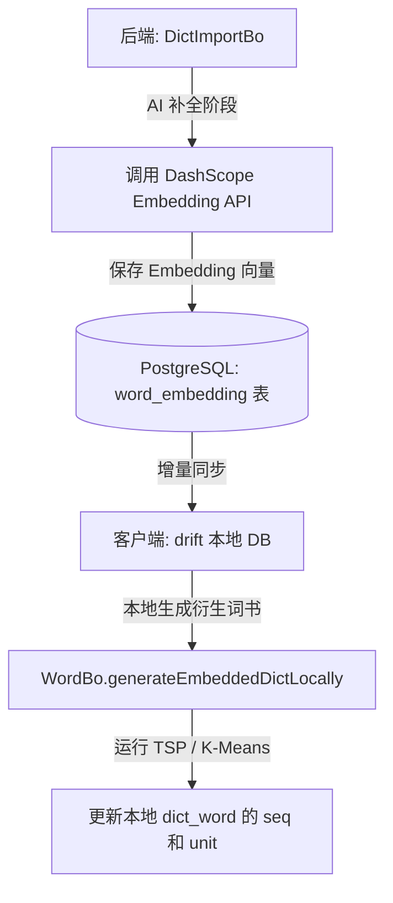

# 词嵌入（Word Embedding）单词书与生词本排序方案

## 1. 背景与动机 (Background & Motivation)

在传统的背单词应用中，单词书的排序方式通常是以下几种之一：
1. **字母顺序 (A-Z)**：容易造成记忆混淆（如同形词汇扎堆，如 *inspect*, *respect*, *suspect* 挨在一起）。
2. **随机/乱序 (MD5/Shuffle)**：缺乏语境联想，单词与单词之间没有任何关联，记忆负荷较大。
3. **词频/重要度排序**：适合根据考试大纲学习，但相邻单词之间依然缺乏语义逻辑联系。

**词嵌入排序方案（Semantic Embedding Sorting）**的核心思想是将单词映射到高维语义空间，利用词向量之间的距离（如余弦相似度）对单词书和生词本进行排列。
这能够带来以下学习体验的提升：
- **语义渐变流（Semantic Flow）**：相邻的单词在语义上具有相关性（例如：*cat* -> *dog* -> *wolf* -> *forest* -> *tree* -> *flower*），让用户在记忆时可以通过联想进行自然的思维过渡，形成语义链条。
- **自动语义聚类（Automatic Clustering）**：将同属一个话题或类别的词（如食物类、科技类、情感类）自动聚集在一起，相当于自动划分“主题单元（Units/Chapters）”。
- **生词本个性化整理**：用户的生词本通常来源杂乱，通过语义排序，可以将碎片化的生词整理成语义关联的词群，极大降低记忆复荷。

---

## 2. 核心技术方案 (Core Technical Components)

### 2.1 词向量数据源选择 (Embedding Vector Source)
为了获取单词的词向量，我们有以下两种可选方案：

| 方案 | 优点 | 缺点 | 推荐程度 |
| :--- | :--- | :--- | :--- |
| **方案 A：离线词向量矩阵 (如 GloVe / Word2Vec)** | 1. 速度极快，无需网络请求。<br>2. 零 API 调用成本。<br>3. 完全支持离线计算和本地排序。 | 1. 离线向量文件占用一定存储空间（如 100-300 维的轻量版约 10-30MB）。<br>2. 对罕见词或专有名词覆盖度不如最新大模型。 | **推荐（作为首选本地排序/基础库）** |
| **方案 B：在线大模型 Embedding API (如阿里云 DashScope text-embedding-v3 / OpenAI)** | 1. 语义表达极其精准，支持新词和多义词。<br>2. 向量维度更丰富。 | 1. 依赖网络请求，大批量词典排序时耗时较长。<br>2. 产生 API 账单费用。 | **推荐（作为后端导入补充/复杂语义分类）** |

**建议组合方案：**
- **后端（Server）**：在系统词书导入时（如 `DictImportBo`），如果单词在库中尚无 Embedding，通过调用大模型 API (如 DashScope/Qwen 的 Embedding 接口) 获取并持久化到数据库。
- **前端（Client）**：随词书同步 Embedding 坐标数据，或者在客户端内置一个精简的英文常用词嵌入矩阵（如 100 维 GloVe，裁剪到常用 2 万词），以便在本地离线对用户的“生词本”进行实时排序。

---

### 2.2 排序算法设计 (Sorting Algorithms)

将多维向量（例如 300 维或 1536 维）排列成一维的线性单词序列，主要有以下三种数学方法：

#### 方法一：一维流形映射（降维排序 - PCA / t-SNE / UMAP）
* **原理**：利用主成分分析（PCA）或 t-SNE 算法，将高维向量投影到 1 维空间，然后直接根据该 1 维坐标值进行升序或降序排列。
* **特点**：
  * **优点**：计算速度极快（$O(N \log N)$ 排序耗时），能够从宏观上把单词书划分为“从具体到抽象”或“从自然到人文”的大尺度渐变。
  * **缺点**：降维到 1D 时会损失大量局部细节，可能导致局部相邻的两个词实际上语义并不太相关。

#### 方法二：基于语义距离的旅行商问题（TSP - Traveling Salesperson Problem）
* **原理**：将单词视为图中的节点，两词之间的距离定义为 $1 - \text{CosineSimilarity}(\vec{u}, \vec{v})$。我们需要寻找一条访问所有单词一次且总语义跳跃（总距离）最小的路径。
* **特点**：
  * **优点**：**局部流畅度最高**。能确保记忆时相邻的两个单词之间语义跳跃最小（如：*coffee* $\to$ *tea* $\to$ *milk* $\to$ *cow*）。
  * **算法实现**：由于 TSP 是 NP 困难问题，对大词书（如 2000 词）可采用**贪心最近邻算法 (Nearest Neighbor)** 配合局部优化的 **2-opt 启发式算法**。计算速度在几秒内，完全可在客户端或服务端完成。

#### 方法三：语义聚类 + 组内排序（Clustering & Intracluster Sort）
* **原理**：
  1. 使用 **K-Means / 层次聚类** 算法，将单词书划分为若干个语义簇（例如每 20-30 个单词为一个 Cluster）。
  2. 对这些聚类簇进行排序，使相关的簇靠在一起（如：水果簇 $\to$ 蔬菜簇 $\to$ 烹饪簇）。
  3. 在每个簇内部，使用 TSP 算法或到中心点的距离进行排序。
  4. 将这些簇对应到单词书的**单元 (Units/Chapters)** 字段，从而自动对无序词书进行“章节划分”。
* **特点**：**最为实用的背单词结构**。既有大方向的主题划分（Units），又有小范围的平滑过渡。

#### 方法四：锚点语义排序（Anchor-based Sorting）
* **原理**：用户输入一个“锚点词”或“主题概念”（如 *technology* 或 *medical*），计算单词书中所有词到该锚点向量的距离，按相似度由高到低排列。
* **特点**：适合阶段性复习，如用户想优先背诵与当前工作/专业相关的词汇。

---

## 3. 系统架构与技术实现路线 (System Architecture)

基于牛牛背单词当前的前后端分离、支持 SQLite 本地同步的架构，我们建议按以下方式整合：



### 3.1 数据库设计 (Database Schema)

#### 后端 PostgreSQL 变更：
新增 `word_embedding` 表，用于存储每个单词的稠密向量（或者利用 PostgreSQL 的 `pgvector` 扩展支持）：
```sql
CREATE TABLE word_embedding (
    word_id VARCHAR(50) PRIMARY KEY REFERENCES word(id) ON DELETE CASCADE,
    embedding BYTEA NOT NULL, -- 以二进制 (float[]) 存储的高维向量，节省空间
    dimension INTEGER NOT NULL,
    update_time TIMESTAMP NOT NULL
);
```

#### 客户端 SQLite (Drift) 变更：
为了支持本地对“生词本”或“自定义词书”的排序，可以将降维后的低维特征同步至本地，或增量同步核心词汇的 Embedding。
在 `dicts` 表中扩展 `sort_alg` 字段的值：
* `sort_alg = 'embedding_tsp'`：表示通过语义最短路径排序的衍生版词书。
* `sort_alg = 'embedding_cluster'`：表示通过语义聚类自动分单元的衍生版词书。

---

### 3.2 核心逻辑接口设计 (Proposed Interfaces)

#### 后端 Embedding 生成服务 (`EmbeddingService.java`)
提供生成、存储与查询词向量的接口：
```java
public interface EmbeddingService {
    // 批量获取或计算单词的 Embedding
    Map<String, float[]> getEmbeddingsForSpells(List<String> spells);
    
    // 对指定的单词列表进行语义排序，返回排序后的 wordId 列表
    List<String> sortBySemanticPath(List<String> wordIds);
    
    // 对指定的单词列表进行语义聚类并排序，划分单元 (Unit)
    List<ClusterResult> clusterAndSort(List<String> wordIds, int wordsPerUnit);
}
```

#### 客户端本地动态生成衍生词书 (`WordBo.dart`)
在 `generateShuffledDictLocally` 旁增加 `generateEmbeddedDictLocally`。
当 `sortAlg` 为语义相关排序时，在本地事务中：
1. 从数据库读取原词书所有单词。
2. 获取对应的 Embedding 数据。
3. 运行本地 TSP 或一维降维算法，重构单词的 `seq`（序号）与 `unit`（单元）。
4. 批量写入本地 `dict_word` 表。

---

## 4. 逐步实现计划 (Phased Implementation Plan)

### 第一阶段：设计与算法原型验证 (Phase 1)
* [ ] 确定词向量获取来源（首选集成 DashScope text-embedding-v3 API 至 `AiBo` 中）。
* [ ] 编写 Python/Java 离线脚本，验证 TSP (Nearest Neighbor + 2-opt) 算法在 2000 个单词上的运行性能与排序语义合理性，确保排序效果令人满意。
* [ ] 在 `design` 目录中整理算法原型评估报告。

### 第二阶段：后端数据链路与同步改造 (Phase 2)
* [ ] 后端数据库添加 `word_embedding` 存储结构。
* [ ] 改造 `DictImportBo.java`，在系统导入新词时，异步并发获取 Embedding 并入库。
* [ ] 提供 Embedding 同步机制，让客户端能够下载必要词汇的向量特征。

### 第三阶段：前端衍生词书生成与 UI 交互实现 (Phase 3)
* [ ] 扩展前端 `dicts` 表与同步机制，支持下载词向量。
* [ ] 在 `WordBo.dart` 中实现 `generateEmbeddedDictLocally`，在客户端支持 `embedding_tsp` 和 `embedding_cluster` 算法。
* [ ] UI 层面：在“词书选择”和“我的生词本”中提供“按语义关联排序”的选项。背单词页面可以显示“语义渐变链条提示”（如：提示下一个词和当前词的语义关系）。

---

## 5. 待讨论与反馈问题 (Open Questions)

为了让我们能产出最符合您设想的方案，请针对以下几点给出您的看法：
1. **运行端选择**：您更倾向于“将排序计算全部在**后端**完成，直接以固定词书形式同步到前端”，还是“前端增量下载词向量，在**本地**动态计算排序（以便能够实时整理用户自己不断变化的生词本）”？
2. **单元划分需求**：背单词通常需要“分 Unit”。我们是否应该将**“语义聚类（Clustering）后自动划分 Unit”**作为默认主打的排序展现形式？
3. **算法复杂度与规模**：如果单词数量很大（例如 8000+ 词的完整词典），计算 TSP 可能会有轻微延迟，是否考虑对于大词表限制每次排序的最大批次，或者在后台异步计算？
