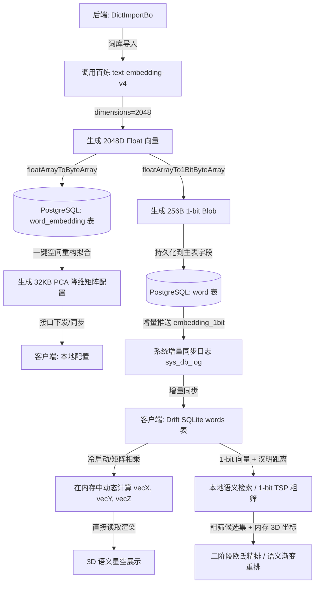

# 词嵌入（Word Embedding）单词书与生词本排序方案

## 1. 背景与动机 (Background & Motivation)

在传统的背单词应用中，单词书的排序方式通常是以下几种之一：
1. **字母顺序 (A-Z)**：容易造成记忆混淆（如同形词汇扎堆，如 *inspect*, *respect*, *suspect* 挨在一起）。
2. **随机/乱序 (MD5/Shuffle)**：缺乏语境联想，单词与单词之间没有任何关联，记忆负荷较大。
3. **词频/重要度排序**：适合根据考试大纲学习，但相邻单词之间依然缺乏语义逻辑联系。

**词嵌入排序方案（Semantic Embedding Sorting）**的核心思想是将单词映射到高维语义空间，利用词向量之间的距离（如余弦相似度）对单词书和生词本进行排列。
这能够带来以下学习体验的提升：
- **语义渐变流（Semantic Flow）**：相邻的单词在语义上具有相关性（例如：*cat* -> *dog* -> *wolf* -> *forest* -> *tree* -> *flower*），让用户在记忆时可以通过联想进行自然的思维过渡，形成语义链条。
- **自动语义聚类（Automatic Clustering）**：将同属一个话题或类别的词（如食物类、科技类、情感类）自动聚集在一起，相当于自动划分“主题单元（Units/Chapters）”。
- **生词本个性化整理**：用户的生词本通常来源杂乱，通过语义排序，可以将碎片化的生词整理成语义关联的词群，极大降低记忆负担。

### 1.1 从“纯 3D 坐标排序”到“2048维 1-bit 量化”的架构演进

在系统演进的早期版本中，我们尝试在本地只保留降维后的 3D 坐标 `(vecX, vecY, vecZ)` 进行词表排序（如 3D-TSP）。然而，实际测试表明，**仅依赖 3D 投影坐标的排序效果并不理想**，常出现生硬的语义跳跃。

其背后的技术根源在于：
* **维度灾难与信息丢失**：3D 坐标是通过线性投影（PCA）或流形拟合（UMAP）将 2048 维高维向量强行压缩得到的。在从 2048 维缩减到 3 维的过程中，**丢失了超过 99.8% 的细粒度特征信息**。
* **投影重叠效应**：在高维空间中相距甚远（语义不相关）的两个词，经过 3D 空间投影后，可能会重合在相邻的位置（类似于三维物体投影到二维平面上产生的遮挡与重合）。这导致 TSP 排序在计算欧氏距离时产生“假邻居”错觉，产生逻辑混乱的语义过渡。
* **局域流形扭曲**：降维算法偏向于保留全局的拓扑或最大的方差结构，对于精细到“近义词匹配”和“微观语义渐变”的局域相似度，3D 坐标计算的精度严重不足。

**为了根治这一问题，我们演进为以下双层混合架构**：
1. **宏观可视化与大尺度排序使用 3D 坐标**：保留 `(vecX, vecY, vecZ)`，仅用于绚丽的 **3D 语义星空渲染**，以及生词本宏观大类（K-Means）的单元切分。
2. **微观高精度检索与渐变流排序使用 2048维 1-bit 二值向量**：将通义百炼 V4 模型输出的最完整 **2048 维高维向量**，在服务端进行 1-bit 量化（正数转为 1，负数转为 0），生成一个固定的 **256 字节** 二进制 Blob。该 Blob 同步至本地，客户端通过极速的 **汉明距离（Hamming Distance）** 进行高精度语义检索与 TSP 重排。这样既获得了极高的语义保真度（保留了原始模型 95%+ 的召回精度），又做到了毫秒级无网检索。

### 1.2 应用场景展示 (Supported Scenarios)

基于我们设计的**“后端保存 2048 维原始向量 + 前端仅同步 1-bit 高维二值向量（直接存入单词表字段） + 客户端内存动态计算 3D 坐标与汉明距离粗筛 + 支持 3D-TSP 路径重排”**架构，系统能够完美支持以下丰富的使用场景：

#### 场景一：语义智能搜索（Semantic Search）
* **用户体验**：用户在搜索框输入 **“悲伤”**、**“跟医院相关的词”**、或者 **“科技互联网”**，系统能瞬间找出词库中语义最接近的单词（如输入“悲伤”得出：*sad, sorrow, grief, melancholy, gloomy, mournful*）。
* **技术实现**：
  1. 后端接收用户输入的自然语言查询，调用 Embedding API 将其转化为 2048 维查询向量 $\vec{q}$。
  2. 利用 PostgreSQL 数据库（可配合 `pgvector` 扩展），对 `word_embedding` 表进行向量余弦相似度计算：$\text{Similarity} = \cos(\vec{q}, \vec{w})$。
  3. 按照相似度从高到低排序，返回前 $N$ 个最相关的单词。

#### 场景二：背单词时的“语义渐变流”（Semantic Flow）
* **用户体验**：在背单词时，单词的切换呈现平滑的语义过渡，例如：*rain (雨) $\to$ umbrella (伞) $\to$ storm (暴风雨) $\to$ wind (风) $\to$#### 2.1.2 高维与低维职责边界分工 (Division of Responsibilities)

为了在“计算性能”、“网络开销”与“体验功能”之间取得最佳平衡，我们将向量特征划分为 **高维 2048D (Float32)**、**高维 2048D (1-bit 量化)** 以及 **低维 3D 坐标** 三种形态，在不同场景下的职责分工如下：

##### 1. 依赖后端高维原始向量（2048D Float32）的场景
* **大模型编码**：用户输入任意查询词或句子（如 *“下雨天出行的装备”*），由于本地不运行大语言模型，需要通过在线 Embedding API 转换为 2048 维的查询向量 $\vec{q}$。
* **降维模型重新训练**：当引进大量新词或更换嵌入模型时，必须使用全库所有词的 2048D 原始向量作为输入，才能拟合出最新的 PCA 投影矩阵或 UMAP 降维模型。

##### 2. 依赖本地高维二值化向量（2048D 1-bit）的场景
* **本地语义智能搜索（离线）**：客户端获取用户的查询向量 $\vec{q}$（经过在线转换）后，将其同样二值化为 1-bit 向量。接着在本地利用 2048 维的 1-bit 单词向量库，进行极速的汉明距离检索，**无需在线服务器进行全词库匹配**，零服务器计算负载。
* **本地近义词/意近词推荐（离线）**：在单词详情页，直接在本地利用 1-bit 向量计算距离，瞬间推荐与当前词最相似的 5 个单词，完全离线且响应时间在微秒级。

##### 3. 仅依赖前端低维坐标（3D）的场景
* **3D 可视化语义星空渲染**：客户端直接读取同步到的 `(vecX, vecY, vecZ)` 坐标，利用 Flutter 3D 渲染引擎快速绘制出绚丽的 3D 星云图。
* **用户生词本本地一键重排 (3D-TSP)**：在 3 维坐标下计算欧氏距离极其快速，手机端可以在 1-2 毫秒内完全离线完成 TSP 路径规划，而 2048 维高维计算会带来不必要的 CPU 负荷。
* **生词本本地快速分单元 (3D-KMeans)**：离线对用户的生词运行 KMeans 聚类进行章节切分，3D 空间计算量微小，保证流畅体验。

---

### 2.2 排序算法设计 (Sorting Algorithms)

将多维向量（例如 300 维或 2048 维）排列成一维的线性单词序列，主要有以下三种数学方法：

#### 方法一：一维流形映射（降维排序 - PCA / t-SNE / UMAP）
* **原理**：利用主成分分析（PCA）或 t-SNE 算法，将高维向量投影到 1 维空间，然后直接根据该 1 维坐标值进行升序或降序排列。
* **特点**：
  * **优点**：计算速度极快（$O(N \log N)$ 排序耗时），能够从宏观上把单词书划分为“从具体到抽象”或“从自然到人文”的大尺度渐变。
  * **缺点**：降维到 1D 时会损失大量局部细节，可能导致局部相邻的两个词实际上语义并不太相关。

#### 方法二：基于语义距离的旅行商问题（TSP - Traveling Salesperson Problem）
* **原理**：将单词视为图中的节点，两词之间的距离定义为 $1 - \text{CosineSimilarity}(\vec{u}, \vec{v})$。我们需要寻找一条访问所有单词一次且总语义跳跃（总距离）最小的路径。
* **特点**：
  * **优点**：**局部流畅度最高**。能确保记忆时相邻的两个单词之间语义跳跃最小（如：*coffee* $\to$ *tea* $\to$ *milk* $\to$ *cow*）。
  * **算法实现**：由于 TSP 是 NP 困难问题，对大词书（如 2000 词）可采用**贪心最近邻算法 (Nearest Neighbor)** 配合局部优化的 **2-opt 启发式算法**。计算速度在几秒内，完全可在客户端或服务端完成。

#### 方法三：语义聚类 + 组内排序（Clustering & Intracluster Sort）
* **原理**：
  1. 使用 **K-Means / 层次聚类** 算法，将单词书划分为若干个语义簇（例如每 20-30 个单词为一个 Cluster）。
  2. 对这些聚类簇进行排序，使相关的簇靠在一起（如：水果簇 $\to$ 蔬菜簇 $\to$ 烹饪簇）。
  3. 在每个簇内部，使用 TSP 算法或到中心点的距离进行排序。
  4. 将这些簇对应到单词书的**单元 (Units/Chapters)** 字段，从而自动对无序词书进行“章节划分”。
* **特点**：**最为实用的背单词结构**。既有大方向的主题划分（Units），又有小范围的平滑过渡。

#### 方法四：锚点语义排序（Anchor-based Sorting）
* **原理**：用户输入一个“锚点词”或“主题概念”（如 *technology* 或 *medical*），计算单词书中所有词到该锚点向量的距离，按相似度由高到低排列。
* **特点**：适合阶段性复习，如用户想优先背诵与当前工作/专业相关的词汇。

#### 2.3 降维与压缩算法：从 2048 维到 3 维 (Dimensionality Reduction to 3D)

为了让高维度的词向量在客户端（手机、电脑）上高效使用，我们需要通过降维算法将大模型的 2048 维 Embedding 压缩为 3 维空间坐标 $(x, y, z)$。

##### 2.3.1 降维数学原理与算法
1. **线性降维：PCA（主成分分析 - Principal Component Analysis）**
   * **原理**：在线性空间中旋转坐标轴，寻找单词特征方差最大的前三个正交方向（主成分），作为新的 $X, Y, Z$ 轴。
   * **特点**：计算极其迅速，能很好地保留高维数据的全局方差结构。
2. **非线性降维：UMAP / t-SNE（流形学习）**
   * **原理**：通过概率分布或流形近似，在低维空间重建高维空间中的“邻近关系”。若两个词在高维中语义接近（如 *cat* 和 *dog*），在 3 维空间里也会被紧密拉在一起；若不相关，则推得很远。
   * **特点**：局部语义关系保留极佳，能自动聚合成形态各异的“语义星云”，非常适合聚类展示。

##### 2.3.2 降维的多重技术优势
* **零持久化存储开销**：3D 坐标完全不需要落盘物理存储，内存计算后只以常驻内存数组或实体成员形式保存（3万词仅占约 **360KB** 内存），实现了磁盘 I/O 和存储空间的双重零开销。
* **毫秒级的本地排序（TSP）**：在 3 维空间下计算欧氏距离极其迅速。在手机端，对数百个生词进行语义最短路径（TSP）重排可在 **1-2 毫秒**内瞬间完成。
* **完美支持离线运行**：前端只需要获取并存储这 3 维坐标，即可在无网状态下随时随地进行生词本的智能语义重排。

##### 2.3.3 降维矩阵的维护与更新策略
降维模型（如 PCA 投影矩阵 $W$ 或 UMAP 模型）的更新分为两种模式以保证系统性能和用户体验的一致性：
1. **日常增量更新（应用投影）**：日常新增少量词汇时，**不更新降维矩阵**。直接利用现有的投影矩阵对新词的 2048 维向量进行线性变换计算得到 $(x, y, z)$ 坐标。这样可以保证已有单词的 3D 星空坐标绝对静止，避免用户记忆的“星云”位置天天漂移。
2. **大版本系统维护（重构矩阵）**：当系统更换底层嵌入模型、或新增了超过 30% 以上的全新领域词汇时，在服务端执行一键重构脚本。利用数据库中留存的所有 2048 维向量，在本地重新拟合训练 PCA/UMAP 降维模型，更新降维矩阵，并刷新所有单词的 3D 坐标下发给前端。由于这是纯本地数学计算，不产生任何 API 费用，且计算在秒级完成。

#### 2.4 前端 3D 语义星空交互设计 (3D Semantic Starfield UI Concept)

利用 3D 坐标 $(x, y, z)$，可以在 Flutter 端构建极具视觉冲击力的背单词交互界面：

```text
+---------------------------------------------------+
|               [ 3D 语义词汇宇宙 ]                  |
|                                                   |
|          .  * (technology cluster)  .             |
|        *   *  Computer *                          |
|         .   /  \   .                              |
|            /    \   * Internet                    |
|           *------*                                |
|           Software                                |
|                                                   |
|                       .   * (medical cluster)     |
|                         *   * Doctor              |
|                          .   * Medicine           |
|                                                   |
|  [ 整理生词 ]   [ 聚焦当前主题 ]   [ 3D视角切换 ]  |
+---------------------------------------------------+
```
* **视觉冲击（WOW 效果）**：用户背过的所有单词在 3D 空间里呈现为繁星点点的宇宙星空。语义相近的词汇自动聚集为“科技星云”、“动植物星云”、“学术抽象星云”。
* **沉浸式交互**：用户可以通过滑动手势自由旋转、缩放 3D 词汇宇宙。双击某片星云可以聚焦并生成对应主题的背单词计划。
* **语义连线**：背单词过程中，界面可以用微弱的星光连线，指示下一个将要学习的词与当前词在 3D 宇宙中的路径和语义过渡。

#### 2.5 2048维 + 1-bit 量化本地打包与极速检索方案 (1-bit Binary Embedding)

为了在本地支持高质量的语义检索，且不增加服务器流量成本与在线检索计算压力，我们引入 **2048维 + 1-bit 量化** 的打包方案。

##### 2.5.1 量化原理与存储开销
1-bit 量化（又称二值化）将 2048 维的实数向量 $\vec{v}$ 的每一维根据正负号压缩为 1 个 bit：
$$b_i = \begin{cases} 1 & \text{if } v_i \ge 0 \\ 0 & \text{if } v_i < 0 \end{cases}$$
2048 维压缩后仅占 **256 字节**（$2048 \div 8$ 字节）。
* **存储体积**：3万词的 1-bit 向量总计仅需 **7.68 MB**，15万词仅需 **38.4 MB**。
* **分发方式**：直接作为静态资源（二进制 Blob 文件或 SQLite 预置库）**打包进 App 包里**，利用应用市场的 CDN 进行分发，**由应用商店承担网络流量费用**。

##### 2.5.2 计算性能与汉明距离
在本地检索时，相似度计算退化为汉明距离（Hamming Distance），在 64 位 CPU 上仅需按位异或（XOR）和 Popcount 指令：
$$\text{Distance}(\vec{x}, \vec{y}) = \sum_{j=1}^{32} \text{Popcount}(x_j \oplus y_j)$$
* **极速搜索**：在 Dart/FFI 层，3 万词的全量检索只需执行 $30,000 \times 32 = 96\text{ 万}$ 次 64位异或及 Popcount。
* **耗时**：在现代手机 CPU 上仅需 **4ms ~ 8ms** 即可在单线程（主线程）中完成 3 万词的暴力检索，完全无需担心 UI 卡顿。

##### 2.5.3 检索精度评估
多项工业界实践表明，2048 维的向量经过 1-bit 量化后，其语义召回精度（NDCG@10）通常可保留 **95% ~ 97%**，由于没有维度截断，其效果要显著优于 1536 维或 1024 维 1-bit 量化。对于单词级别的语义近义搜索，该精度损耗完全可以忽略，用户体验与 Full-Float32 极其接近。

---

## 3. 具体改造与实施路径 (Detailed Implementation & Migration Guide)

在目前的系统基础上，我们需要进行如下的前后端协同改造：



### 3.1 后端（Java）改动说明

#### 1. 数据库表结构与 PO 类改造
* **任务**：
  1. 服务端 `word` 单词主表直接新增 `embedding_1bit` 字段（`BYTEA`，256字节），并**彻底移除** `vec_x`, `vec_y`, `vec_z` 字段。
  2. 修改 [Word.java](file:///Volumes/ssd/ppdc/server/nnbdc-service/src/main/java/beidanci/service/po/Word.java)，移除 `vecX`, `vecY`, `vecZ` 的 JPA 成员，新增 `embedding1bit`。
  3. 后台管理表 `word_embedding` 同样增加并持久化 `embedding_1bit`，供初始化或生成更新包时导出使用。
* **SQL 脚本**：
  ```sql
  ALTER TABLE word DROP COLUMN IF EXISTS vec_x;
  ALTER TABLE word DROP COLUMN IF EXISTS vec_y;
  ALTER TABLE word DROP COLUMN IF EXISTS vec_z;
  ALTER TABLE word ADD COLUMN embedding_1bit BYTEA;
  ```

#### 2. API 参数与嵌入模型升级
* **位置**：[EmbeddingBo.java](file:///Volumes/ssd/ppdc/server/nnbdc-service/src/main/java/beidanci/service/bo/EmbeddingBo.java)
* **修改**：
  * 将 `CURRENT_MODEL_NAME` 变更为 `"text-embedding-v4"`。
  * 在向通义百炼发送 POST 请求的 `getEmbeddings` 方法中，将 `dimensions` 设为 `2048`。
  * 实现二值化转换工具方法：
    ```java
    public static byte[] floatArrayTo1BitByteArray(float[] floats) {
        assert floats.length == 2048 : "向量维度必须为 2048";
        byte[] bytes = new byte[256];
        for (int i = 0; i < 2048; i++) {
            if (floats[i] >= 0) {
                int byteIdx = i / 8;
                int bitIdx = i % 8;
                bytes[byteIdx] |= (1 << bitIdx);
            }
        }
        return bytes;
    }
    ```
  * 在 `completeEmbeddingsForDict` 和 `completeEmbeddingsForMissingWords` 方法中，获取 2048 维向量后，生成 256 字节的 `embedding_1bit` 并一并写入数据库。

#### 3. 降维重构脚本自适应适配
* **位置**：[reconstruct_pca.py](file:///Volumes/ssd/ppdc/server/nnbdc-service/src/main/resources/reconstruct_pca.py)
* **修改**：修改降维样本少于 3 个时的降级备用逻辑，使其适配 2048 维度：
  ```python
  dim = embeddings.shape[1]
  mean = np.mean(embeddings, axis=0) if len(embeddings) > 0 else np.zeros(dim, dtype=np.float32)
  W = np.zeros((dim, 3), dtype=np.float32)
  ```

#### 4. 传输 DTO 与增量同步改造
* **POJO/DTO 修改**：在 [WordDto.java](file:///Volumes/ssd/ppdc/server/nnbdc-api/src/main/java/beidanci/api/model/WordDto.java) 中增加 `private byte[] embedding1bit;` 及其 Get/Set 方法。
* **日志与同步逻辑**：在 [EmbeddingBo.java](file:///Volumes/ssd/ppdc/server/nnbdc-service/src/main/java/beidanci/service/bo/EmbeddingBo.java) 对 word 进行更新或 PCA 重构时，在构建 `WordDto` 时一并装填 `embedding_1bit`，使其通过 `sysDbSyncBo.logOperation` 下发给所有客户端。

---

### 3.2 前端（Flutter/Dart）改动说明

#### 1. 本地数据库表定义与迁移
* **Drift 表定义**：修改 [table.dart](file:///Volumes/ssd/ppdc/app/lib/db/table.dart) 的 `Words` 表定义，**删除** `vecX`, `vecY`, `vecZ` 字段，直接追加 `BlobColumn get embedding1bit => blob().nullable()();`。
* **数据库迁移**：修改 [db.dart](file:///Volumes/ssd/ppdc/app/lib/db/db.dart)，升级当前数据库版本。在数据库升级迁移回调（Migration Strategy）中，调用删除列 `vec_x`, `vec_y`, `vec_z` 并新增 `embedding_1bit` 列的操作。

#### 2. 数据导入与同步拦截
* **修改位置**：修改 [dict_import_isolate.dart](file:///Volumes/ssd/ppdc/app/lib/db/dict_import_isolate.dart) 和 [dto.dart](file:///Volumes/ssd/ppdc/app/lib/api/dto.dart)，在解析服务端下发的 Word 数据包时，读取并映射 `embedding1bit` 字段，最终将其写进 SQLite 的 `words` 表。

#### 3. 客户端二阶段检索与 1-bit TSP 算法实现
* **汉明距离计算**：在客户端编写高效的汉明距离计算方法：
  ```dart
  int computeHammingDistance(Uint8List a, Uint8List b) {
    int distance = 0;
    for (int i = 0; i < a.length; i++) {
      int xor = a[i] ^ b[i];
      // 快速 popcount (这里可采用 8 位查表法或位运算技巧)
      distance += _popCount8(xor);
    }
    return distance;
  }

  int _popCount8(int x) {
    x = x - ((x >> 1) & 0x55);
    x = (x & 0x33) + ((x >> 2) & 0x33);
    return (((x + (x >> 4)) & 0x0F) * 0x01);
  }
  ```
* **混合检索逻辑 (1-bit 粗筛 + 3D 精排)**：
  为了根治 3D 排序的不理想，本地排序/近义推荐的逻辑改造为：
  1. 使用用户的查询词（或当前浏览的单词）的 `embedding1bit` 向量；
  2. 遍历本地词库中的 1-bit 向量，计算汉明距离，筛选出距离最近的 **Top 100** 个候选词（粗筛）；
  3. 利用这 100 个词本地的 `(vecX, vecY, vecZ)` 坐标，与目标词进行三维欧氏距离计算，排定最终的 **Top 5** 结果（精排）。

---

## 4. 逐步实现计划 (Phased Implementation Plan)

### 第一阶段：设计与算法原型验证 (Phase 1)
* [x] 确定词向量获取来源（集成 DashScope text-embedding-v4 API 至 `AiBo` 中，显式设置 dimensions=2048）。
* [x] 在 `design` 目录中整理算法原型评估报告，确定以 2048 维 1-bit 二值化向量作为本地检索基础。

### 第二阶段：后端数据链路与同步改造 (Phase 2)
* [ ] 后端数据库添加 `word_embedding` 存储结构（添加 `embedding_1bit BYTEA` 字段，256字节）。
* [ ] 改造 [EmbeddingBo.java](file:///Volumes/ssd/ppdc/server/nnbdc-service/src/main/java/beidanci/service/bo/EmbeddingBo.java)，在调用百炼 API 时请求 2048 维向量，并在入库时进行 1-bit 二值化预计算。
* [ ] 改造 [reconstruct_pca.py](file:///Volumes/ssd/ppdc/server/nnbdc-service/src/main/resources/reconstruct_pca.py)，适配自适应 of 2048 维度输入。
* [ ] 提供 Embedding 同步机制，改造 `WordDto`，使客户端能够增量下载 `embedding_1bit` 字段。

### 第三阶段：前端衍生词书生成与 UI 交互实现 (Phase 3)
* [ ] 升级客户端数据库版本，增加 `Words.embedding1bit` 字段的物理迁移。
* [ ] 扩展前端同步机制，下载并持久化 `embedding1bit` 字段。
* [ ] 在客户端实现 1-bit 二值二阶段混合检索排序算法，重构近义词推荐及离线智能搜索模块，根治原 3D 排序不平滑问题。
* [ ] UI 层面：背单词页面可以使用微弱星光线来指示下一个词的语义流动，增强背单词时的语义相关连线效果。

---

## 5. 待讨论与反馈问题 (Open Questions)

1. **运行端选择**：您更倾向于“将排序计算全部在**后端**完成，直接以固定词书形式同步到前端”，还是“前端增量下载词向量，在**本地**动态计算排序（以便能够实时整理用户自己不断变化的生词本）”？
2. **单元划分需求**：背单词通常需要“分 Unit”。我们是否应该将**“语义聚类（Clustering）后自动划分 Unit”**作为默认主打的排序展现形式？
3. **算法复杂度与规模**：如果单词数量很大（例如 8000+ 词的完整词典），计算 TSP 可能会有轻微延迟，是否考虑对于大词表限制每次排序的最大批次，或者在前端/后台使用异步计算并分批规划以保障流畅体验？
