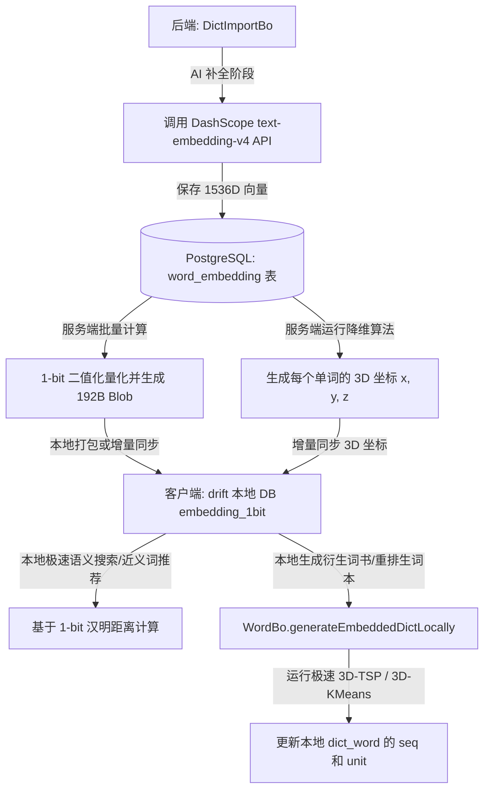

# 词嵌入（Word Embedding）单词书与生词本排序方案

## 1. 背景与动机 (Background & Motivation)

在传统的背单词应用中，单词书的排序方式通常是以下几种之一：
1. **字母顺序 (A-Z)**：容易造成记忆混淆（如同形词汇扎堆，如 *inspect*, *respect*, *suspect* 挨在一起）。
2. **随机/乱序 (MD5/Shuffle)**：缺乏语境联想，单词与单词之间没有任何关联，记忆负荷较大。
3. **词频/重要度排序**：适合根据考试大纲学习，但相邻单词之间依然缺乏语义逻辑联系。

**词嵌入排序方案（Semantic Embedding Sorting）**的核心思想是将单词映射到高维语义空间，利用词向量之间的距离（如余弦相似度）对单词书和生词本进行排列。
这能够带来以下学习体验的提升：
- **语义渐变流（Semantic Flow）**：相邻的单词在语义上具有相关性（例如：*cat* -> *dog* -> *wolf* -> *forest* -> *tree* -> *flower*），让用户在记忆时可以通过联想进行自然的思维过渡，形成语义链条。
- **自动语义聚类（Automatic Clustering）**：将同属一个话题或类别的词（如食物类、科技类、情感类）自动聚集在一起，相当于自动划分“主题单元（Units/Chapters）”。
- **生词本个性化整理**：用户的生词本通常来源杂乱，通过语义排序，可以将碎片化的生词整理成语义关联的词群，极大降低记忆负担。

### 1.1 应用场景展示 (Supported Scenarios)

基于我们设计的**“后端保存 1536 维原始向量 + 前端同步 3D 降维坐标 + 1-bit 本地打包极速检索 + 支持 3D-TSP 路径重排”**架构，系统能够完美支持以下丰富的使用场景：

#### 场景一：语义智能搜索（Semantic Search）
* **用户体验**：用户在搜索框输入 **“悲伤”**、**“跟医院相关的词”**、或者 **“科技互联网”**，系统能瞬间找出词库中语义最接近的单词（如输入“悲伤”得出：*sad, sorrow, grief, melancholy, gloomy, mournful*）。
* **技术实现**：
  1. 后端接收用户输入的自然语言查询，调用 Embedding API 将其转化为 1536 维查询向量 $\vec{q}$。
  2. 利用 PostgreSQL 数据库（可配合 `pgvector` 扩展），对 `word_embedding` 表进行向量余弦相似度计算：$\text{Similarity} = \cos(\vec{q}, \vec{w})$。
  3. 按照相似度从高到低排序，返回前 $N$ 个最相关的单词。

#### 场景二：背单词时的“语义渐变流”（Semantic Flow）
* **用户体验**：在背单词时，单词的切换呈现平滑的语义过渡，例如：*rain (雨) $\to$ umbrella (伞) $\to$ storm (暴风雨) $\to$ wind (风) $\to$ kite (风筝) $\to$ sky (天空)*。
* **技术实现**：利用 3D-TSP（三维空间旅行商路径规划）算法，在选定词书中规划一条总语义跨度最短的闭合路径，更新单词的排列顺序。

#### 场景三：生词本的“一键语义归类整理”（Vocabulary Organizer）
* **用户体验**：用户的生词本往往是由阅读时随手标记的零碎单词组成，杂乱无章。用户点击“一键整理”后，生词本中的单词自动按语义聚类并重排，相关的生词扎堆呈现（如所有动物词放一起，所有情感词放一起），成批背诵效率倍增。
* **技术实现**：客户端在本地利用同步到的 3D 空间坐标，运行 K-Means 聚类和 3D-TSP，快速在本地重排生词序列，无需联网。

#### 场景四：同义词 / 意近词推荐（Synonym & Related Words）
* **用户体验**：在查看单词详情页时，底部会自动推荐一个“语义推荐链”或“意近词卡片”（如查看 *happy* 时，推荐 *joyful, cheerful, delighted*），方便用户进行发散记忆和对比记忆。
* **技术实现**：直接在本地或后端查询与当前词 3D 坐标或 1536D 向量距离最近的 Top 5 单词。

#### 场景五：3D 语义星空可视化宇宙（3D Starfield）
* **用户体验**：提供一个酷炫 of 3D 星空界面。用户背过的每个单词都化为一颗繁星。**“科技词汇”**汇聚成一片蓝色星云，**“情感词汇”**汇聚成一片粉色星云。用户可以旋转缩放星空，甚至直接点击某片星云“聚拢”复习。
* **技术实现**：利用 Flutter 3D 粒子渲染引擎，直接读取本地 Words 表中同步的 `vecX, vecY, vecZ` 坐标进行绘制。

#### 场景六：词书导入时的“自动章节（Unit）划分”
* **用户体验**：管理员或用户上传一本杂乱的 txt 单词书，系统导入后，能自动将其拆分为“Unit 1: 自然与天气”、“Unit 2: 医疗与健康”等章节。
* **技术实现**：后端通过 1536D 向量跑 K-Means 聚类，并将同一聚类簇的词分配到同一个 `unit` 编号中。

---

## 2. 核心技术方案 (Core Technical Components)

### 2.1 词向量数据源选择 (Embedding Vector Source)
为了获取单词的词向量，我们有以下两种可选方案：

| 方案 | 优点 | 缺点 | 推荐程度 |
| :--- | :--- | :--- | :--- |
| **方案 A：离线词向量矩阵 (如 GloVe / Word2Vec)** | 1. 速度极快，无需网络请求。<br>2. 零 API 调用成本。<br>3. 完全支持离线计算和本地排序。 | 1. 离线向量文件占用一定存储空间（如 100-300 维的轻量版约 10-30MB）。<br>2. 对罕见词或专有名词覆盖度不如最新大模型。 | **推荐（作为首选本地排序/基础库）** |
| **方案 B：在线大模型 Embedding API (如阿里云 DashScope text-embedding-v4 / OpenAI)** | 1. 语义表达极其精准，支持新词和多义词。<br>2. 向量维度更丰富，最大支持 1536 维或 2048 维。 | 1. 依赖网络请求，大批量词典排序时耗时较长。<br>2. 产生 API 账单费用。 | **推荐（作为后端导入补充/复杂语义分类）** |

**建议组合方案：**
- **后端（Server）**：在系统词书导入时（如 `DictImportBo`），如果单词在库中尚无 Embedding，通过调用大模型 API（如阿里云 DashScope 的 `text-embedding-v4` 接口，并显式传入参数 `dimensions=1536`）获取 1536 维的向量特征并持久化到数据库。
- **前端（Client）**：随词书下载并打包 1-bit 二值化向量（1536D，仅 192 字节/词）以支持本地的高精度离线语义检索与推荐；同时同步 3D 降维坐标数据，以便在本地对用户的“生词本”进行 3D 星云图展示和快速的 3D-TSP/3D-KMeans 重排。

#### 2.1.1 向量模型的升级与不可混用性 (Model Upgrades & Non-mixability)

在更换或升级后端使用的 Embedding 模型时，必须注意以下核心逻辑与注意事项：

1. **向量空间的不可混用性**
   * **原理**：不同模型所投射的向量空间在数学上是完全不同的。就像在不同投影坐标系下的地图，两者的数值特征不可互相比较。
   * **影响**：如果数据库中混用了不同模型生成的向量，它们之间的余弦相似度计算将彻底失效。因此，**所有参与排序与空间计算的单词，必须使用同一个嵌入模型生成的向量**。
2. **平滑升级与静默迁移策略**
   * **设计**：在 `word_embedding` 表中引入 `model_name`（或 `model_version`）字段，显式记录每个单词向量所使用的模型。
   * **增量迁移**：当系统配置文件中的嵌入模型升级时，系统无需中断。后台扫描任务或导入任务在运行过程中，一旦发现某个单词的 `model_name` 与当前配置不符，就会自动为该单词重新请求新模型，实现增量、静默的平滑过渡。
3. **低成本的一键重构**
   * **可行性分析**：英文词典库是一个大小相对固定（一般在 2 万到 8 万词之间）的闭环集合。
   * **费用与时间**：调用大模型 Embedding API 的成本极低（如 DashScope $0.0001/1000 tokens）。重构 5 万个常用单词的向量，总 API 费用仅需几元钱人民币，且在几分钟内即可通过并发请求全部完成。因此，**升级模型在架构上具有极高的可行性与低经济负担**。

#### 2.1.2 高维与低维职责边界分工 (Division of Responsibilities)

为了在“计算性能”、“网络开销”与“体验功能”之间取得最佳平衡，我们将向量特征划分为 **高维 1536D (Float32)**、**高维 1536D (1-bit 量化)** 以及 **低维 3D 坐标** 三种形态，在不同场景下的职责分工如下：

##### 1. 依赖后端高维原始向量（1536D Float32）的场景
* **大模型编码**：用户输入任意查询词或句子（如 *“下雨天出行的装备”*），由于本地不运行大语言模型，需要通过在线 Embedding API 转换为 1536 维的查询向量 $\vec{q}$。
* **降维模型重新训练**：当引进大量新词或更换嵌入模型时，必须使用全库所有词的 1536D 原始向量作为输入，才能拟合出最新的 PCA 投影矩阵或 UMAP 降维模型。

##### 2. 依赖本地高维二值化向量（1536D 1-bit）的场景
* **本地语义智能搜索（离线）**：客户端获取用户的查询向量 $\vec{q}$（经过在线转换）后，将其同样二值化为 1-bit 向量。接着在本地利用 1536 维的 1-bit 单词向量库，进行极速的汉明距离检索，**无需在线服务器进行全词库匹配**，零服务器计算负载。
* **本地近义词/意近词推荐（离线）**：在单词详情页，直接在本地利用 1-bit 向量计算距离，瞬间推荐与当前词最相似的 5 个单词，完全离线且响应时间在微秒级。

##### 3. 仅依赖前端低维坐标（3D）的场景
* **3D 可视化语义星空渲染**：客户端直接读取同步到的 `(vecX, vecY, vecZ)` 坐标，利用 Flutter 3D 渲染引擎快速绘制出绚丽的 3D 星云图。
* **用户生词本本地一键重排 (3D-TSP)**：在 3 维坐标下计算欧氏距离极其快速，手机端可以在 1-2 毫秒内完全离线完成 TSP 路径规划，而 1536 维计算会带来不必要的 CPU 负荷。
* **生词本本地快速分单元 (3D-KMeans)**：离线对用户的生词运行 KMeans 聚类进行章节切分，3D 空间计算量微小，保证流畅体验。

---

### 2.2 排序算法设计 (Sorting Algorithms)

将多维向量（例如 300 维或 1536 维）排列成一维的线性单词序列，主要有以下三种数学方法：

#### 方法一：一维流形映射（降维排序 - PCA / t-SNE / UMAP）
* **原理**：利用主成分分析（PCA）或 t-SNE 算法，将高维向量投影到 1 维空间，然后直接根据该 1 维坐标值进行升序或降序排列。
* **特点**：
  * **优点**：计算速度极快（$O(N \log N)$ 排序耗时），能够从宏观上把单词书划分为“从具体到抽象”或“从自然到人文”的大尺度渐变。
  * **缺点**：降维到 1D 时会损失大量局部细节，可能导致局部相邻的两个词实际上语义并不太相关。

#### 方法二：基于语义距离的旅行商问题（TSP - Traveling Salesperson Problem）
* **原理**：将单词视为图中的节点，两词之间的距离定义为 $1 - \text{CosineSimilarity}(\vec{u}, \vec{v})$。我们需要寻找一条访问所有单词一次且总语义跳跃（总距离）最小的路径。
* **特点**：
  * **优点**：**局部流畅度最高**。能确保记忆时相邻的两个单词之间语义跳跃最小（如：*coffee* $\to$ *tea* $\to$ *milk* $\to$ *cow*）。
  * **算法实现**：由于 TSP 是 NP 困难问题，对大词书（如 2000 词）可采用**贪心最近邻算法 (Nearest Neighbor)** 配合局部优化的 **2-opt 启发式算法**。计算速度在几秒内，完全可在客户端或服务端完成。

#### 方法三：语义聚类 + 组内排序（Clustering & Intracluster Sort）
* **原理**：
  1. 使用 **K-Means / 层次聚类** 算法，将单词书划分为若干个语义簇（例如每 20-30 个单词为一个 Cluster）。
  2. 对这些聚类簇进行排序，使相关的簇靠在一起（如：水果簇 $\to$ 蔬菜簇 $\to$ 烹饪簇）。
  3. 在每个簇内部，使用 TSP 算法或到中心点的距离进行排序。
  4. 将这些簇对应到单词书的**单元 (Units/Chapters)** 字段，从而自动对无序词书进行“章节划分”。
* **特点**：**最为实用的背单词结构**。既有大方向的主题划分（Units），又有小范围的平滑过渡。

#### 方法四：锚点语义排序（Anchor-based Sorting）
* **原理**：用户输入一个“锚点词”或“主题概念”（如 *technology* 或 *medical*），计算单词书中所有词到该锚点向量的距离，按相似度由高到低排列。
* **特点**：适合阶段性复习，如用户想优先背诵与当前工作/专业相关的词汇。

#### 2.3 降维与压缩算法：从 1536 维到 3 维 (Dimensionality Reduction to 3D)

为了让高维度的词向量在客户端（手机、电脑）上高效使用，我们需要通过降维算法将大模型的 1536 维 Embedding 压缩为 3 维空间坐标 $(x, y, z)$。

##### 2.3.1 降维数学原理与算法
1. **线性降维：PCA（主成分分析 - Principal Component Analysis）**
   * **原理**：在线性空间中旋转坐标轴，寻找单词特征方差最大的前三个正交方向（主成分），作为新的 $X, Y, Z$ 轴。
   * **特点**：计算极其迅速，能很好地保留高维数据的全局方差结构。
2. **非线性降维：UMAP / t-SNE（流形学习）**
   * **原理**：通过概率分布或流形近似，在低维空间重建高维空间中的“邻近关系”。若两个词在高维中语义接近（如 *cat* 和 *dog*），在 3 维空间里也会被紧密拉在一起；若不相关，则推得很远。
   * **特点**：局部语义关系保留极佳，能自动聚合成形态各异的“语义星云”，非常适合聚类展示。

##### 2.3.2 降维的多重技术优势
* **极低的存储开销**：原 1536 维 float 向量每个词需占 6KB；降至 3 维只需 3 个 float 值（12 字节），2 万个词的总大小仅为 **240KB**。客户端数据库可以非常轻松地同步并常驻内存。
* **毫秒级的本地排序（TSP）**：在 3 维空间下计算欧氏距离极其迅速。在手机端，对数百个生词进行语义最短路径（TSP）重排可在 **1-2 毫秒**内瞬间完成。
* **完美支持离线运行**：前端只需要获取并存储这 3 维坐标，即可在无网状态下随时随地进行生词本的智能语义重排。

##### 2.3.3 降维矩阵的维护与更新策略
降维模型（如 PCA 投影矩阵 $W$ 或 UMAP 模型）的更新分为两种模式以保证系统性能和用户体验的一致性：
1. **日常增量更新（应用投影）**：日常新增少量词汇时，**不更新降维矩阵**。直接利用现有的投影矩阵对新词的 1536 维向量进行线性变换计算得到 $(x, y, z)$ 坐标。这样可以保证已有单词的 3D 星空坐标绝对静止，避免用户记忆的“星云”位置天天漂移。
2. **大版本系统维护（重构矩阵）**：当系统更换底层嵌入模型、或新增了超过 30% 以上的全新领域词汇时，在服务端执行一键重构脚本。利用数据库中留存的所有 1536 维向量，在本地重新拟合训练 PCA/UMAP 降维模型，更新降维矩阵，并刷新所有单词的 3D 坐标下发给前端。由于这是纯本地数学计算，不产生任何 API 费用，且计算在秒级完成。

#### 2.4 前端 3D 语义星空交互设计 (3D Semantic Starfield UI Concept)

利用 3D 坐标 $(x, y, z)$，可以在 Flutter 端构建极具视觉冲击力的背单词交互界面：

```text
+---------------------------------------------------+
|               [ 3D 语义词汇宇宙 ]                  |
|                                                   |
|          .  * (technology cluster)  .             |
|        *   *  Computer *                          |
|         .   /  \   .                              |
|            /    \   * Internet                    |
|           *------*                                |
|           Software                                |
|                                                   |
|                       .   * (medical cluster)     |
|                         *   * Doctor              |
|                          .   * Medicine           |
|                                                   |
|  [ 整理生词 ]   [ 聚焦当前主题 ]   [ 3D视角切换 ]  |
+---------------------------------------------------+
```
* **视觉冲击（WOW 效果）**：用户背过的所有单词在 3D 空间里呈现为繁星点点的宇宙星空。语义相近的词汇自动聚集为“科技星云”、“动植物星云”、“学术抽象星云”。
* **沉浸式交互**：用户可以通过滑动手势自由旋转、缩放 3D 词汇宇宙。双击某片星云可以聚焦并生成对应主题的背单词计划。
* **语义连线**：背单词过程中，界面可以用微弱的星光连线，指示下一个将要学习的词与当前词在 3D 宇宙中的路径和语义过渡。

#### 2.5 1536维 + 1-bit 量化本地打包与极速检索方案 (1-bit Binary Embedding)

为了在本地支持高质量的语义检索，且不增加服务器流量成本与在线检索计算压力，我们引入 **1536维 + 1-bit 量化** 的打包方案。

##### 2.5.1 量化原理与存储开销
1-bit 量化（又称二值化）将 1536 维的实数向量 $\vec{v}$ 的每一维根据正负号压缩为 1 个 bit：
$$b_i = \begin{cases} 1 & \text{if } v_i \ge 0 \\ 0 & \text{if } v_i < 0 \end{cases}$$
1536 维压缩后仅占 **192 字节**（$1536 \div 8$ 字节）。
* **存储体积**：3万词的 1-bit 向量总计仅需 **5.76 MB**，15万词仅需 **28.8 MB**。
* **分发方式**：直接作为静态资源（二进制 Blob 文件或 SQLite 预置库）**打包进 App 包里**，利用应用市场的 CDN 进行分发，**由应用商店承担网络流量费用**。

##### 2.5.2 计算性能与汉明距离
在本地检索时，相似度计算退化为汉明距离（Hamming Distance），在 64 位 CPU 上仅需按位异或（XOR）和 Popcount 指令：
$$\text{Distance}(\vec{x}, \vec{y}) = \sum_{j=1}^{24} \text{Popcount}(x_j \oplus y_j)$$
* **极速搜索**：在 Dart/FFI 层，3 万词的全量检索只需执行 $30,000 \times 24 = 72\text{ 万}$ 次 64位异或及 Popcount。
* **耗时**：在现代手机 CPU 上仅需 **3ms ~ 7.5ms** 即可在单线程（主线程）中完成 3 万词的暴力检索，完全无需担心 UI 卡顿。

##### 2.5.3 检索精度评估
多项工业界实践表明，1536 维的向量经过 1-bit 量化后，其语义召回精度（NDCG@10）通常可保留 **93% ~ 97%**，比 1024 维 1-bit 更加饱满精细。对于单词级别的语义近义搜索，该精度损耗完全可以忽略，用户体验与 Full-Float32 极其接近。

---

## 3. 系统架构与技术实现路线 (System Architecture)

基于牛牛背单词当前的前后端分离、支持 SQLite 本地同步的架构，我们建议按以下方式整合：



### 3.1 数据库设计 (Database Schema)

#### 后端 PostgreSQL 变更：
1. `word_embedding` 表扩展，用于存储高维向量和预计算的 1-bit 向量：
```sql
CREATE TABLE word_embedding (
    word_id VARCHAR(50) PRIMARY KEY REFERENCES word(id) ON DELETE CASCADE,
    embedding BYTEA NOT NULL,       -- 以二进制 (float[]) 存储的高维向量，节省空间
    embedding_1bit BYTEA NOT NULL,  -- 服务端预计算好的 1-bit 压缩向量（固定 192 字节）
    dimension INTEGER NOT NULL,
    update_time TIMESTAMP NOT NULL
);
```
2. 在 `word` 表中新增 3 维坐标字段（或新建 `word_vector_3d` 表），专门用于下发给前端进行快速计算与渲染：
```sql
ALTER TABLE word ADD COLUMN vec_x REAL;
ALTER TABLE word ADD COLUMN vec_y REAL;
ALTER TABLE word ADD COLUMN vec_z REAL;
```

#### 客户端 SQLite (Drift) 变更：
在客户端本地 `words` 表中扩展这 3 维坐标和 1-bit 量化向量：
```dart
// app/lib/db/table.dart 扩展
class Words extends Table {
  // ... 现有字段
  RealColumn get vecX => real().nullable()();
  RealColumn get vecY => real().nullable()();
  RealColumn get vecZ => real().nullable()();
  
  // 1536维 1-bit 压缩向量，固定长度 192 字节
  BlobColumn get embedding1bit => blob().nullable()();
}
```

在 `dicts` 表中扩展 `sort_alg` 字段的值：
* `sort_alg = 'embedding_tsp'`：表示通过语义最短路径（3D 空间 TSP 路径）排序的衍生版词书。
* `sort_alg = 'embedding_cluster'`：表示通过语义聚类（3D 空间 K-Means）自动分单元的衍生版词书。

---

### 3.2 核心逻辑接口设计 (Proposed Interfaces)

#### 后端 Embedding 生成服务 (`EmbeddingService.java`)
提供生成、存储与查询词向量的接口：
```java
public interface EmbeddingService {
    // 批量获取或计算单词的 Embedding
    Map<String, float[]> getEmbeddingsForSpells(List<String> spells);
    
    // 对指定的单词列表进行语义排序，返回排序后的 wordId 列表
    List<String> sortBySemanticPath(List<String> wordIds);
    
    // 对指定的单词列表进行语义聚类并排序，划分单元 (Unit)
    List<ClusterResult> clusterAndSort(List<String> wordIds, int wordsPerUnit);
}
```

#### 客户端本地动态生成衍生词书 (`WordBo.dart`)
在 `generateShuffledDictLocally` 旁增加 `generateEmbeddedDictLocally`。
当 `sortAlg` 为语义相关排序时，在本地事务中：
1. 从数据库读取原词书所有单词。
2. 获取对应的 Embedding 数据。
3. 运行本地 TSP 或一维降维算法，重构单词的 `seq`（序号）与 `unit`（单元）。
4. 批量写入本地 `dict_word` 表。

---

## 4. 逐步实现计划 (Phased Implementation Plan)

### 第一阶段：设计与算法原型验证 (Phase 1)
* [ ] 确定词向量获取来源（首选集成 DashScope text-embedding-v4 API 至 `AiBo` 中，显式设置 dimensions=1536）。
* [ ] 编写 Python/Java 离线脚本，验证 TSP (Nearest Neighbor + 2-opt) 算法在 2000 个单词上的运行性能与排序语义合理性，确保排序效果令人满意。
* [ ] 在 `design` 目录中整理算法原型评估报告。

### 第二阶段：后端数据链路与同步改造 (Phase 2)
* [ ] 后端数据库添加 `word_embedding` 存储结构（包含 Float32 数组和 192字节 1-bit 二进制）。
* [ ] 改造 `DictImportBo.java`，在系统导入新词时，异步并发获取 Embedding 并入库。
* [ ] 提供 Embedding 同步机制，让客户端能够下载必要词汇的向量特征。

### 第三阶段：前端衍生词书生成与 UI 交互实现 (Phase 3)
* [ ] 扩展前端 `dicts` 表与同步机制，支持下载词向量。
* [ ] 在 `WordBo.dart` 中实现 `generateEmbeddedDictLocally`，在客户端支持 `embedding_tsp` 和 `embedding_cluster` 算法。
* [ ] UI 层面：在“词书选择”和“我的生词本”中提供“按语义关联排序”的选项。背单词页面可以显示“语义渐变链条提示”（如：提示下一个词和当前词的语义关系）。

---

## 5. 待讨论与反馈问题 (Open Questions)

为了让我们能产出最符合您设想的方案，请针对以下几点给出您的看法：
1. **运行端选择**：您更倾向于“将排序计算全部在**后端**完成，直接以固定词书形式同步到前端”，还是“前端增量下载词向量，在**本地**动态计算排序（以便能够实时整理用户自己不断变化的生词本）”？
2. **单元划分需求**：背单词通常需要“分 Unit”。我们是否应该将**“语义聚类（Clustering）后自动划分 Unit”**作为默认主打的排序展现形式？
3. **算法复杂度与规模**：如果单词数量很大（例如 8000+ 词的完整词典），计算 TSP 可能会有轻微延迟，是否考虑对于大词表限制每次排序的最大批次，或者在后台异步计算？
